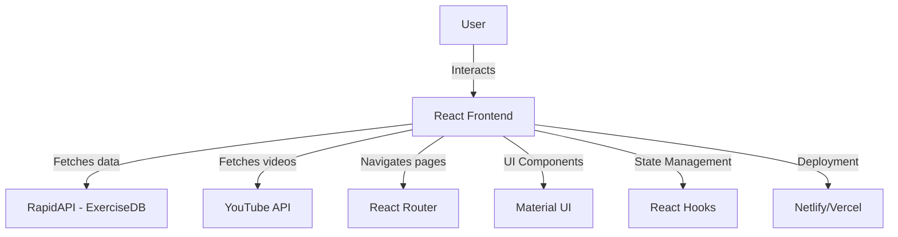

# Fitness Exercises App
so until now we decided to implement a website with react and node such a gym website totally we are developing a website and we are trying use packages for this website instead of coding a lot because as long as we familliar with packages it's going to be easy for coding and also saving the time.
## Description
This is a **React 18 fitness exercises app** that allows users to explore exercises based on muscle groups and equipment. It fetches real-time exercise data from **RapidAPI**, displays related exercise videos, and provides details on each exercise. The app is styled using **Material UI** and includes smooth navigation with **React Router DOM**.

## Features
- 🏋️ **Search for exercises** by name, muscle group, or equipment.
- 🎥 **Fetch related exercise videos** from YouTube.
- 📊 **Detailed exercise pages** with targeted muscles and equipment info.
- 📌 **Filter by categories** such as back, legs, abs, etc.
- 🔄 **Pagination support** for better user experience.
- 🎨 **Beautiful UI with Material UI** components.
- 🚀 **Fully responsive design** for mobile and desktop.
- 🌎 **Deployed version available on Netlify/Vercel.**

## Architecture Diagram


## Planned Features
- ✅ **Dark Mode Support**
- 🔥 **Workout Plan Generator**
- 📌 **Favorites & Saved Exercises**
- 📝 **User Authentication & Profiles**
- 🏆 **Leaderboard for Fitness Challenges**
- 📊 **Progress Tracker with Analytics**

## Installation
```sh
git clone https://github.com/alilite/AICoach/edit/main
cd fitness-exercises-app
npm install
npm start
```

## Deployment
To deploy on **Netlify**:
1. Run `npm run build`
2. Upload the `build` folder to Netlify

## Technologies Used
- **React 18** (Frontend)
- **Material UI** (Styling)
- **RapidAPI (ExerciseDB, YouTube API)** (Data Fetching)
- **React Router DOM** (Navigation)
- **Axios / Fetch API** (HTTP Requests)
- **Node.js & npm** (Package Management)
- **Netlify/Vercel** (Deployment)

## License
MIT License
